# 🧠 NexusMind

<div align="center">

```
    ╔══════════════════════════════════════╗
    ║                                      ║
    ║           🧠 NexusMind 🧠            ║
    ║                                      ║
    ║     Intelligent Scientific           ║
    ║     Reasoning through                ║
    ║     Graph-of-Thoughts                ║
    ║                                      ║
    ╚══════════════════════════════════════╝
```

#### **Intelligent Scientific Reasoning through Graph-of-Thoughts**

[](https://github.com/SaptaDey/NexusMind/releases)
[](https://www.python.org/downloads/)
[](LICENSE) <!-- Assuming LICENSE file will be added -->
[](Dockerfile)
[](https://fastapi.tiangolo.com)
[](https://networkx.org)
[](CHANGELOG.md)
<!-- Add a GitHub Actions badge for documentation build once active -->
<!-- [](https://github.com/sapta-dey/NexusMind-2.0/actions/workflows/gh-pages.yml) -->

</div>

<div align="center">
  <p><strong>🚀 Next-Generation AI Reasoning Framework for Scientific Research</strong></p>
  <p><em>Leveraging graph structures to transform how AI systems approach scientific reasoning</em></p>
</div>

## 📚 Documentation

**For comprehensive information on NexusMind, including detailed installation instructions, usage guides, configuration options, API references, contribution guidelines, and the project roadmap, please visit our full documentation site:**

**[➡️ NexusMind Documentation Site](https://sapta-dey.github.io/NexusMind-2.0/)** 
*(Note: This link will be active once the GitHub Pages site is deployed via the new workflow.)*

## 🔍 Overview

NexusMind leverages a **Neo4j graph database** to perform sophisticated scientific reasoning, with graph operations managed within its pipeline stages. It implements the **Model Context Protocol (MCP)** to integrate with AI applications like Claude Desktop, providing an Advanced Scientific Reasoning Graph-of-Thoughts (ASR-GoT) framework designed for complex research tasks.

**Key highlights:**
- Process complex scientific queries using graph-based reasoning
- Dynamic confidence scoring with multi-dimensional evaluations 
- Built with modern Python and FastAPI for high performance
- Dockerized for easy deployment
- Modular design for extensibility and customization
- Integration with Claude Desktop via MCP protocol

## 📂 Project Structure

The project is organized as follows (see the documentation site for more details):
```
NexusMind/
├── 📁 .github/                           # GitHub specific files (workflows)
├── 📁 config/                             # Configuration files (settings.yaml)
├── 📁 docs_src/                           # Source files for MkDocs documentation
├── 📁 src/                                # Source code
│   └── 📁 asr_got_reimagined/            # Main application package
├── 📁 tests/                             # Test suite
├── Dockerfile                            # Docker container definition
├── docker-compose.yml                    # Docker Compose for development
├── docker-compose.prod.yml               # Docker Compose for production
├── mkdocs.yml                            # MkDocs configuration
├── poetry.lock                           # Poetry dependency lock file
├── pyproject.toml                        # Python project configuration (Poetry)
├── pyrightconfig.json                    # Pyright type checker configuration
├── README.md                             # This file
└── setup_claude_connection.py            # Script for Claude Desktop connection setup (manual run)
```

## 🚀 Getting Started

### Deployment Prerequisites

Before running NexusMind (either locally or via Docker if not using the provided `docker-compose.prod.yml` which includes Neo4j), ensure you have:

-   **A running Neo4j Instance**: NexusMind requires a connection to a Neo4j graph database.
    -   **APOC Library**: Crucially, the Neo4j instance **must** have the APOC (Awesome Procedures On Cypher) library installed. Several Cypher queries within the application's reasoning stages utilize APOC procedures (e.g., `apoc.create.addLabels`, `apoc.merge.node`). Without APOC, the application will not function correctly. You can find installation instructions on the [official APOC website](https://neo4j.com/labs/apoc/installation/).
    -   **Configuration**: Ensure that your `config/settings.yaml` (or corresponding environment variables) correctly points to your Neo4j instance URI, username, and password.
    -   **Indexing**: For optimal performance, ensure appropriate Neo4j indexes are created. See [Neo4j Indexing Strategy](docs/neo4j_indexing.md) for details.

    *Note: The provided `docker-compose.yml` (for development) and `docker-compose.prod.yml` (for production) already include a Neo4j service with the APOC library pre-configured, satisfying this requirement when using Docker Compose.*

### Prerequisites

- **Python 3.11+** (as specified in `pyproject.toml`, e.g., the Docker image uses Python 3.11.x or 3.12.x, 3.13.x)
- **[Poetry](https://python-poetry.org/docs/#installation)**: For dependency management
- **[Docker](https://www.docker.com/get-started)** and **[Docker Compose](https://docs.docker.com/compose/install/)**: For containerized deployment

### Installation and Setup (Local Development)

1. **Clone the repository**:
   ```bash
   git clone https://github.com/SaptaDey/NexusMind.git
   cd NexusMind
   ```

2. **Install dependencies using Poetry**:
   ```bash
   poetry install
   ```
   This creates a virtual environment and installs all necessary packages specified in `pyproject.toml`.

3. **Activate the virtual environment**:
   ```bash
   poetry shell
   ```

4. **Configure the application**:
   ```bash
   # Copy example configuration
   cp config/settings.example.yaml config/settings.yaml
   
   # Edit configuration as needed
   vim config/settings.yaml
   ```

5. **Set up environment variables** (optional):
   ```bash
   # Create .env file for sensitive configuration
   echo "LOG_LEVEL=DEBUG" > .env
   echo "API_HOST=0.0.0.0" >> .env
   echo "API_PORT=8000" >> .env
   ```

6. **Run the development server**:
   ```bash
   python src/asr_got_reimagined/main.py
   ```
   
   Alternatively, for more control:
   ```bash
   uvicorn asr_got_reimagined.main:app --reload --host 0.0.0.0 --port 8000
   ```
   
   The API will be available at `http://localhost:8000`.

### Docker Deployment

```mermaid
graph TB
    subgraph "Development Environment"
        A[👨‍💻 Developer] --> B[🐳 Docker Compose]
    end
    
    subgraph "Container Orchestration"
        B --> C[📦 NexusMind Container]
        B --> D[📊 Monitoring Container]
        B --> E[🗄️ Database Container]
    end
    
    subgraph "NexusMind Application"
        C --> F[⚡ FastAPI Server]
        F --> G[🧠 ASR-GoT Engine]
        F --> H[🔌 MCP Protocol]
    end
    
    subgraph "External Integrations"
        H --> I[🤖 Claude Desktop]
        H --> J[🔗 Other AI Clients]
    end
    
    style A fill:#e1f5fe
    style B fill:#f3e5f5
    style C fill:#e8f5e8
    style F fill:#fff3e0
    style G fill:#ffebee
    style H fill:#f1f8e9
```



1. **Quick Start with Docker Compose**:
   ```bash
   # Build and run all services
   docker-compose up --build
   
   # For detached mode (background)
   docker-compose up --build -d
   
   # View logs
   docker-compose logs -f nexusmind
   ```

2. **Individual Docker Container**:
   ```bash
   # Build the image
   docker build -t nexusmind:latest .
   
   # Run the container
   docker run -p 8000:8000 -v $(pwd)/config:/app/config nexusmind:latest
   ```

3. **Production Deployment**:
   ```bash
   # Use production compose file
   docker-compose -f docker-compose.prod.yml up --build -d
   ```

### Notes on Specific Deployment Platforms

-   **Smithery.ai**: Deployment to the Smithery.ai platform typically involves using the provided Docker image directly.
    *   Consult Smithery.ai's specific documentation for instructions on deploying custom Docker images.
    *   **Port Configuration**: Ensure that the platform is configured to expose port 8000 (or the port configured via `APP_PORT` if overridden) for the NexusMind container, as this is the default port used by the FastAPI application.
    *   **Health Checks**: Smithery.ai may use health checks to monitor container status. The NexusMind Docker image includes a `HEALTHCHECK` instruction that verifies the `/health` endpoint (e.g., `http://localhost:8000/health`). Ensure Smithery.ai is configured to use this endpoint if it requires a specific health check path.
    *   The provided `Dockerfile` and `docker-compose.prod.yml` serve as a baseline for understanding the container setup. Adapt as per Smithery.ai's requirements.

4. **Access the Services**:
   - **API Documentation**: `http://localhost:8000/docs`
   - **Health Check**: `http://localhost:8000/health`
   - **MCP Endpoint**: `http://localhost:8000/mcp`

## 🔌 API Endpoints

The primary API endpoints exposed by NexusMind are:

- **MCP Protocol Endpoint**: `POST /mcp`
  - This endpoint is used for communication with MCP clients like Claude Desktop.
  - Example Request for the `asr_got.query` method:
    ```json
    {
      "jsonrpc": "2.0",
      "method": "asr_got.query",
      "params": {
        "query": "Analyze the relationship between microbiome diversity and cancer progression.",
        "parameters": {
          "include_reasoning_trace": true,
          "include_graph_state": false
        }
      },
      "id": "123"
    }
    ```
  - Other supported MCP methods include `initialize` and `shutdown`.

- **Health Check Endpoint**: `GET /health`
  - Provides a simple health status of the application.
  - Example Response:
    ```json
    {
      "status": "healthy",
      "version": "0.1.0" 
    }
    ```
    *(Note: The timestamp field shown previously is not part of the current health check response.)*

The advanced API endpoints previously listed (e.g., `/api/v1/graph/query`) are not implemented in the current version and are reserved for potential future development.

## Session Handling (`session_id`)

Currently, the `session_id` parameter available in API requests (e.g., for `asr_got.query`) and present in responses serves primarily to identify and track a single, complete query-response cycle. It is also used for correlating progress notifications (like `got/queryProgress`) with the originating query.

While the system generates and utilizes `session_id`s, NexusMind does not currently support true multi-turn conversational continuity where the detailed graph state or reasoning context from a previous query is automatically loaded and reused for a follow-up query using the same `session_id`. Each query is processed independently at this time.

### Future Enhancement: Persistent Sessions

A potential future enhancement for NexusMind is the implementation of persistent sessions. This would enable more interactive and evolving reasoning processes by allowing users to:

1.  **Persist State:** Store the generated graph state and relevant reasoning context from a query, associated with its `session_id`, likely within the Neo4j database.
2.  **Reload State:** When a new query is submitted with an existing `session_id`, the system could reload this saved state as the starting point for further processing.
3.  **Refine and Extend:** Allow the new query to interact with the loaded graph—for example, by refining previous hypotheses, adding new evidence to existing structures, or exploring alternative reasoning paths based on the established context.

Implementing persistent sessions would involve developing robust strategies for:
*   Efficiently storing and retrieving session-specific graph data in Neo4j.
*   Managing the lifecycle (e.g., creation, update, expiration) of session data.
*   Designing sophisticated logic for how new queries merge with, modify, or extend pre-existing session contexts and graphs.

This is a significant feature that could greatly enhance the interactive capabilities of NexusMind. Contributions from the community in designing and implementing persistent session functionality are welcome.

### Future Enhancement: Asynchronous and Parallel Stage Execution

Currently, the 8 stages of the NexusMind reasoning pipeline are executed sequentially. For complex queries or to further optimize performance, exploring asynchronous or parallel execution for certain parts of the pipeline is a potential future enhancement.

**Potential Areas for Parallelism:**

*   **Hypothesis Generation:** The `HypothesisStage` generates hypotheses for each dimension identified by the `DecompositionStage`. The process of generating hypotheses for *different, independent dimensions* could potentially be parallelized. For instance, if three dimensions are decomposed, three parallel tasks could work on generating hypotheses for each respective dimension.
*   **Evidence Integration (Partial):** Within the `EvidenceStage`, if multiple hypotheses are selected for evaluation, the "plan execution" phase (simulated evidence gathering) for these different hypotheses might be performed concurrently.

**Challenges and Considerations:**

Implementing parallel stage execution would introduce complexities that need careful management:

*   **Data Consistency:** Concurrent operations, especially writes to the Neo4j database (e.g., creating multiple hypothesis nodes or evidence nodes simultaneously), must be handled carefully to ensure data integrity and avoid race conditions. Unique ID generation schemes would need to be robust for parallel execution.
*   **Transaction Management:** Neo4j transactions for concurrent writes would need to be managed appropriately.
*   **Dependency Management:** Ensuring that stages (or parts of stages) that truly depend on the output of others are correctly sequenced would be critical.
*   **Resource Utilization:** Parallel execution could increase resource demands (CPU, memory, database connections).
*   **Complexity:** The overall control flow of the `GoTProcessor` would become more complex.

While the current sequential execution ensures a clear and manageable data flow, targeted parallelism in areas like hypothesis generation for independent dimensions could offer performance benefits for future versions of NexusMind. This remains an open area for research and development.

## 🧪 Testing & Quality Assurance

<div align="center">
  <table>
    <tr>
      <td align="center">🧪<br><b>Testing</b></td>
      <td align="center">🔍<br><b>Type Checking</b></td>
      <td align="center">✨<br><b>Linting</b></td>
      <td align="center">📊<br><b>Coverage</b></td>
    </tr>
    <tr>
      <td align="center">
        <pre>poetry run pytest</pre>
        <pre>make test</pre>
      </td>
      <td align="center">
        <pre>poetry run mypy src/</pre>
        <pre>pyright src/</pre>
      </td>
      <td align="center">
        <pre>poetry run ruff check .</pre>
        <pre>poetry run ruff format .</pre>
      </td>
      <td align="center">
        <pre>poetry run pytest --cov=src</pre>
        <pre>coverage html</pre>
      </td>
    </tr>
  </table>
</div>

### Development Commands

```bash
# Run full test suite with coverage using Poetry
poetry run pytest --cov=src --cov-report=html --cov-report=term

# Or using Makefile for the default test run
make test

# Run specific test categories (using poetry)
poetry run pytest tests/unit/stages/          # Stage-specific tests
poetry run pytest tests/integration/         # Integration tests
poetry run pytest -k "test_confidence"       # Tests matching pattern

# Type checking and linting (can also be run via Makefile targets: make lint, make check-types)
poetry run mypy src/ --strict                # Strict type checking
poetry run ruff check . --fix                # Auto-fix linting issues
poetry run ruff format .                     # Format code

# Pre-commit hooks (recommended)
poetry run pre-commit install                # Install hooks
poetry run pre-commit run --all-files       # Run all hooks

# See Makefile for other useful targets like 'make all-checks'.
```

## 🗺️ Roadmap and Future Directions

We have an exciting vision for the future of NexusMind! Our roadmap includes plans for enhanced graph visualization, integration with more data sources like Arxiv, and further refinements to the core reasoning engine.

For more details on our planned features and long-term goals, please see our [Roadmap](ROADMAP.md) (also available on the documentation site).

## 🗺️ Roadmap and Future Directions

We have an exciting vision for the future of NexusMind! Our roadmap includes plans for enhanced graph visualization, integration with more data sources like Arxiv, and further refinements to the core reasoning engine.

For more details on our planned features and long-term goals, please see our [Roadmap](ROADMAP.md).

## 🤝 Contributing

We welcome contributions! Please see our [Contributing Guidelines](CONTRIBUTING.md) (also available on the documentation site) for details on how to get started, our branching strategy, code style, and more.

## 📄 License

This project is licensed under the Apache License 2.0. (A `LICENSE` file should be present in the repository root).

## 🙏 Acknowledgments

- **NetworkX** community for graph analysis capabilities
- **FastAPI** team for the excellent web framework
- **Pydantic** for robust data validation
- The scientific research community for inspiration and feedback

---

<div align="center">
  <p><strong>Built with ❤️ for the scientific research community</strong></p>
  <p><em>NexusMind - Advancing scientific reasoning through intelligent graph structures</em></p>
</div>