# 🧠 NexusMind

<div align="center">

```
    ╔══════════════════════════════════════╗
    ║                                      ║
    ║           🧠 NexusMind 🧠            ║
    ║                                      ║
    ║     Intelligent Scientific           ║
    ║     Reasoning through                ║
    ║     Graph-of-Thoughts                ║
    ║                                      ║
    ╚══════════════════════════════════════╝
```

#### **Intelligent Scientific Reasoning through Graph-of-Thoughts**

[](https://github.com/SaptaDey/NexusMind/releases)
[](https://www.python.org/downloads/)
[](LICENSE)
[](Dockerfile)
[](https://fastapi.tiangolo.com)
[](https://networkx.org)
[](CHANGELOG.md)

</div>

<div align="center">
  <p><strong>🚀 Next-Generation AI Reasoning Framework for Scientific Research</strong></p>
  <p><em>Leveraging graph structures to transform how AI systems approach scientific reasoning</em></p>
</div>

## 🔍 Overview

NexusMind leverages a **Neo4j graph database** to perform sophisticated scientific reasoning, with graph operations managed within its pipeline stages. It implements the **Model Context Protocol (MCP)** to integrate with AI applications like Claude Desktop, providing an Advanced Scientific Reasoning Graph-of-Thoughts (ASR-GoT) framework designed for complex research tasks.

**Key highlights:**
- Process complex scientific queries using graph-based reasoning
- Dynamic confidence scoring with multi-dimensional evaluations 
- Built with modern Python and FastAPI for high performance
- Dockerized for easy deployment
- Modular design for extensibility and customization
- Integration with Claude Desktop via MCP protocol

## 🌟 Key Features

### 8-Stage Reasoning Pipeline

```mermaid
graph TD
    A[🌱 Stage 1: Initialization] --> B[🧩 Stage 2: Decomposition]
    B --> C[🔬 Stage 3: Hypothesis/Planning]
    C --> D[📊 Stage 4: Evidence Integration]
    D --> E[✂️ Stage 5: Pruning/Merging]
    E --> F[🔍 Stage 6: Subgraph Extraction]
    F --> G[📝 Stage 7: Composition]
    G --> H[🤔 Stage 8: Reflection]
    
    A1[Create root node<br/>Set initial confidence<br/>Define graph structure] --> A
    B1[Break into dimensions<br/>Identify components<br/>Create dimensional nodes] --> B
    C1[Generate hypotheses<br/>Create reasoning strategy<br/>Set falsification criteria] --> C
    D1[Gather evidence<br/>Link to hypotheses<br/>Update confidence scores] --> D
    E1[Remove low-value elements<br/>Consolidate similar nodes<br/>Optimize structure] --> E
    F1[Identify relevant portions<br/>Focus on high-value paths<br/>Create targeted subgraphs] --> F
    G1[Synthesize findings<br/>Create coherent insights<br/>Generate comprehensive answer] --> G
    H1[Evaluate reasoning quality<br/>Identify improvements<br/>Final confidence assessment] --> H
    
    style A fill:#e1f5fe
    style B fill:#f3e5f5
    style C fill:#e8f5e8
    style D fill:#fff3e0
    style E fill:#ffebee
    style F fill:#f1f8e9
    style G fill:#e3f2fd
    style H fill:#fce4ec
```



The core reasoning process follows a sophisticated 8-stage pipeline:

1. **🌱 Initialization**
   - Creates root node from query with multi-dimensional confidence vector
   - Establishes initial graph structure with proper metadata
   - Sets baseline confidence across empirical, theoretical, methodological, and consensus dimensions

2. **🧩 Decomposition**
   - Breaks query into key dimensions: Scope, Objectives, Constraints, Data Needs, Use Cases
   - Identifies potential biases and knowledge gaps from the outset
   - Creates dimensional nodes with initial confidence assessments

3. **🔬 Hypothesis/Planning**
   - Generates 3-5 hypotheses per dimension with explicit falsification criteria
   - Creates detailed execution plans for each hypothesis
   - Tags with disciplinary provenance and impact estimates

4. **📊 Evidence Integration**
   - Iteratively selects hypotheses based on confidence-to-cost ratio and impact
   - Gathers and links evidence using typed edges (causal, temporal, correlative)
   - Updates confidence vectors using Bayesian methods with statistical power assessment

5. **✂️ Pruning/Merging**
   - Removes nodes with low confidence and impact scores
   - Consolidates semantically similar nodes
   - Optimizes graph structure while preserving critical relationships

6. **🔍 Subgraph Extraction**
   - Identifies high-value subgraphs based on multiple criteria
   - Focuses on nodes with high confidence and impact scores
   - Extracts patterns relevant to the original query

7. **📝 Composition**
   - Synthesizes findings into coherent narrative
   - Annotates claims with node IDs and edge types
   - Provides comprehensive answers with proper citations

8. **🤔 Reflection**
   - Performs comprehensive quality audit
   - Evaluates coverage, bias detection, and methodological rigor
   - Provides final confidence assessment and improvement recommendations

### Advanced Technical Capabilities

<div align="center">
  <table>
    <tr>
      <td align="center">🔄 <b>Multi-Dimensional<br>Confidence</b></td>
      <td align="center">🧠 <b>Graph-Based<br>Knowledge</b></td>
      <td align="center">🔌 <b>MCP<br>Integration</b></td>
      <td align="center">⚡ <b>FastAPI<br>Backend</b></td>
    </tr>
    <tr>
      <td align="center">🐳 <b>Docker<br>Deployment</b></td>
      <td align="center">🧩 <b>Modular<br>Design</b></td>
      <td align="center">⚙️ <b>Configuration<br>Management</b></td>
      <td align="center">🔒 <b>Type<br>Safety</b></td>
    </tr>
    <tr>
      <td align="center">🌐 <b>Interdisciplinary<br>Bridge Nodes</b></td>
      <td align="center">🔗 <b>Hyperedge<br>Support</b></td>
      <td align="center">📊 <b>Statistical<br>Power Analysis</b></td>
      <td align="center">🎯 <b>Impact<br>Estimation</b></td>
    </tr>
  </table>
</div>

### Architectural Highlights

NexusMind is built around a flexible 8-stage pipeline architecture, where each stage encapsulates specific reasoning logic. This design promotes modularity and clarity.

-   **8-Stage Pipeline Design**: The core reasoning process is broken down into eight distinct stages, from initialization to reflection. Each stage has a well-defined responsibility.
-   **Stage-Specific Logic and Neo4j Interaction**: Graph operations and interactions with the Neo4j database are primarily handled within individual stages. Each stage formulates and executes Cypher queries relevant to its task, utilizing `neo4j_utils` for database communication. This means the graph representation is persisted and manipulated directly within Neo4j.
-   **Orchestration by `GoTProcessor`**: The `GoTProcessor` acts as the central orchestrator. It manages the flow through the 8-stage pipeline, invoking each stage in sequence. It does not manage a central graph object in memory; rather, it facilitates the overall process.
-   **Data Flow Between Stages**: Data is passed between stages using `GoTProcessorSessionData` and `accumulated_context`. Each stage receives context from previous stages and can contribute its findings to the `accumulated_context`, which is then available to subsequent stages. This allows for a progressive build-up of insights as the pipeline executes.

**Core Features:**
- **🧠 Graph Knowledge Representation**: Utilizes a **Neo4j graph database** to model complex relationships. Graph interactions and manipulations are performed by individual pipeline stages using Cypher queries via `neo4j_utils`.
- **🔄 Dynamic Confidence Vectors**: Four-dimensional confidence assessment (empirical support, theoretical basis, methodological rigor, consensus alignment)
- **🌐 Interdisciplinary Bridge Nodes**: Automatically connects insights across different research domains
- **🔗 Advanced Edge Types**: Supports causal, temporal, correlative, and custom relationship types
- **📊 Statistical Rigor**: Integrated power analysis and effect size estimation
- **🎯 Impact-Driven Prioritization**: Focuses on high-impact research directions
- **🔌 MCP Server**: Seamless Claude Desktop integration with Model Context Protocol
- **⚡ High-Performance API**: Modern FastAPI implementation with async support

## 🛠️ Technology Stack

<div align="center">
  <table>
    <tr>
      <td align="center"><br>Python 3.11+</td>
      <td align="center"><br>FastAPI</td>
      <td align="center"><br>NetworkX</td>
      <td align="center"><br>Docker</td>
    </tr>
    <tr>
      <td align="center"><br>Pytest</td>
      <td align="center"><br>Pydantic</td>
      <td align="center"><br>Poetry</td>
      <td align="center"><br>Uvicorn</td>
    </tr>
  </table>
</div>

## 📂 Project Structure

```
NexusMind/
├── 📁 .devcontainer/                     # VS Code Remote - Containers configuration
│   └── devcontainer.json
├── 📁 .github/                           # GitHub specific files (e.g., workflows)
│   └── 📁 workflows/
│       └── codeql.yml
├── 📁 .md/                               # Markdown files for project documentation
│   ├── CHANGELOG.md
│   ├── CLAUDE_INTEGRATION.md
│   ├── PYTHON_UPGRADE_SUMMARY.md
│   └── claude_desktop_integration.md
├── 📁 config/                             # Configuration files
│   ├── settings.yaml                      # Main application settings
│   └── claude_mcp_config.json            # Claude MCP integration config
│
├── 📁 docs/                              # Project documentation
│   ├── 📁 examples/                      # Example files
│   │   └── initialize_request.json
│   ├── 📁 setup/                         # Setup related documentation
│   │   └── neo4j_windows_wsl2_docs.md
│   └── 📁 testing/                       # Testing related documentation
│       └── testing_strategy_and_example.md
│
├── 📁 scripts/                           # Utility and helper scripts
│   ├── add_evidence_types.py
│   ├── add_type_annotations.py
│   ├── add_type_hints.py
│   ├── extract_clean_stage4.py
│   ├── fix_imports.py
│   ├── fix_indentation.py
│   ├── fix_stage4_evidence.py
│   └── 📁 profiling/
│       ├── analyze_profile.py
│       └── profile_runner.py
│
├── 📁 src/                                # Source code
│   └── 📁 asr_got_reimagined/            # Main application package
│       ├── 📁 api/                       # API layer (FastAPI)
│       │   ├── 📁 routes/                # API route definitions
│       │   │   ├── __init__.py
│       │   │   └── mcp.py                # MCP protocol endpoints
│       │   ├── __init__.py
│       │   └── schemas.py                # API request/response Pydantic schemas
│       │
│       ├── 📁 domain/                    # Core business logic and domain models
│       │   ├── 📁 models/                # Pydantic models for domain entities
│       │   │   ├── __init__.py
│       │   │   ├── common.py
│       │   │   ├── common_types.py
│       │   │   └── graph_elements.py
│       │   ├── 📁 services/              # Business logic services
│       │   │   ├── __init__.py
│       │   │   ├── got_processor.py      # Main Graph-of-Thoughts processing service
│       │   │   └── neo4j_utils.py        # Neo4j database utilities
│       │   ├── 📁 stages/                # 8-Stage GoT pipeline implementation
│       │   │   ├── __init__.py
│       │   │   ├── base_stage.py
│       │   │   ├── stage_1_initialization.py
│       │   │   ├── stage_2_decomposition.py
│       │   │   ├── stage_3_hypothesis.py
│       │   │   ├── stage_4_evidence.py
│       │   │   ├── stage_5_pruning_merging.py
│       │   │   ├── stage_6_subgraph_extraction.py
│       │   │   ├── stage_7_composition.py
│       │   │   └── stage_8_reflection.py
│       │   ├── 📁 utils/                 # Utility functions for domain logic
│       │   │   ├── __init__.py
│       │   │   ├── graph_analysis_helpers.py
│       │   │   ├── graph_analysis_neo4j.py
│       │   │   ├── loguru_types.py
│       │   │   ├── math_helpers.py
│       │   │   └── metadata_helpers.py
│       │   └── __init__.py
│       │
│       ├── 📁 loguru-stubs/              # Type stubs for Loguru
│       │   └── __init__.pyi
│       ├── __init__.py
│       ├── app_setup.py                  # FastAPI application setup and configuration
│       ├── config.py                     # Pydantic settings configuration
│       └── main.py                       # Application entry point (Uvicorn runner)
│
├── 📁 tests/                             # Test suite
│   ├── 📁 integration/                   # Integration tests
│   │   └── 📁 api/                       # API specific integration tests
│   │       ├── 📁 data/
│   │       │   └── test_query.json
│   │       ├── socket_test.py
│   │       ├── test_http_mcp.py
│   │       ├── test_mcp_endpoints.py
│   │       ├── test_request.py
│   │       └── test_server.py
│   └── __init__.py
│
├── Dockerfile                            # Docker container definition
├── docker-compose.yml                    # Docker Compose for development
├── docker-compose.prod.yml               # Docker Compose for production
├── .dockerignore                         # Docker ignore patterns
├── .gitignore                            # Git ignore patterns
├── mypy.ini                              # MyPy type checking configuration
├── poetry.lock                           # Poetry dependency lock file
├── pyproject.toml                        # Python project configuration (Poetry)
├── pyrightconfig.json                    # Pyright type checker configuration
├── README.md                             # This file
└── setup_claude_connection.py            # Script for Claude Desktop connection setup (manual run)
```

## 🚀 Getting Started

### Deployment Prerequisites

Before running NexusMind (either locally or via Docker if not using the provided `docker-compose.prod.yml` which includes Neo4j), ensure you have:

-   **A running Neo4j Instance**: NexusMind requires a connection to a Neo4j graph database.
    -   **APOC Library**: Crucially, the Neo4j instance **must** have the APOC (Awesome Procedures On Cypher) library installed. Several Cypher queries within the application's reasoning stages utilize APOC procedures (e.g., `apoc.create.addLabels`, `apoc.merge.node`). Without APOC, the application will not function correctly. You can find installation instructions on the [official APOC website](https://neo4j.com/labs/apoc/installation/).
    -   **Configuration**: Ensure that your `config/settings.yaml` (or corresponding environment variables) correctly points to your Neo4j instance URI, username, and password.
    -   **Indexing**: For optimal performance, ensure appropriate Neo4j indexes are created. See [Neo4j Indexing Strategy](docs/neo4j_indexing.md) for details.

    *Note: The provided `docker-compose.yml` (for development) and `docker-compose.prod.yml` (for production) already include a Neo4j service with the APOC library pre-configured, satisfying this requirement when using Docker Compose.*

### Prerequisites

- **Python 3.11+** (as specified in `pyproject.toml`, e.g., the Docker image uses Python 3.11.x or 3.12.x, 3.13.x)
- **[Poetry](https://python-poetry.org/docs/#installation)**: For dependency management
- **[Docker](https://www.docker.com/get-started)** and **[Docker Compose](https://docs.docker.com/compose/install/)**: For containerized deployment

### Installation and Setup (Local Development)

1. **Clone the repository**:
   ```bash
   git clone https://github.com/SaptaDey/NexusMind.git
   cd NexusMind
   ```

2. **Install dependencies using Poetry**:
   ```bash
   poetry install
   ```
   This creates a virtual environment and installs all necessary packages specified in `pyproject.toml`.

3. **Activate the virtual environment**:
   ```bash
   poetry shell
   ```

4. **Configure the application**:
   ```bash
   # Copy example configuration
   cp config/settings.example.yaml config/settings.yaml
   
   # Edit configuration as needed
   vim config/settings.yaml
   ```

5. **Set up environment variables** (optional):
   ```bash
   # Create .env file for sensitive configuration
   echo "LOG_LEVEL=DEBUG" > .env
   echo "API_HOST=0.0.0.0" >> .env
   echo "API_PORT=8000" >> .env
   ```

6. **Run the development server**:
   ```bash
   python src/asr_got_reimagined/main.py
   ```
   
   Alternatively, for more control:
   ```bash
   uvicorn asr_got_reimagined.main:app --reload --host 0.0.0.0 --port 8000
   ```
   
   The API will be available at `http://localhost:8000`.

### Docker Deployment

```mermaid
graph TB
    subgraph "Development Environment"
        A[👨‍💻 Developer] --> B[🐳 Docker Compose]
    end
    
    subgraph "Container Orchestration"
        B --> C[📦 NexusMind Container]
        B --> D[📊 Monitoring Container]
        B --> E[🗄️ Database Container]
    end
    
    subgraph "NexusMind Application"
        C --> F[⚡ FastAPI Server]
        F --> G[🧠 ASR-GoT Engine]
        F --> H[🔌 MCP Protocol]
    end
    
    subgraph "External Integrations"
        H --> I[🤖 Claude Desktop]
        H --> J[🔗 Other AI Clients]
    end
    
    style A fill:#e1f5fe
    style B fill:#f3e5f5
    style C fill:#e8f5e8
    style F fill:#fff3e0
    style G fill:#ffebee
    style H fill:#f1f8e9
```



1. **Quick Start with Docker Compose**:
   ```bash
   # Build and run all services
   docker-compose up --build
   
   # For detached mode (background)
   docker-compose up --build -d
   
   # View logs
   docker-compose logs -f nexusmind
   ```

2. **Individual Docker Container**:
   ```bash
   # Build the image
   docker build -t nexusmind:latest .
   
   # Run the container
   docker run -p 8000:8000 -v $(pwd)/config:/app/config nexusmind:latest
   ```

3. **Production Deployment**:
   ```bash
   # Use production compose file
   docker-compose -f docker-compose.prod.yml up --build -d
   ```

### Notes on Specific Deployment Platforms

-   **Smithery.ai**: Deployment to the Smithery.ai platform typically involves using the provided Docker image directly.
    *   Consult Smithery.ai's specific documentation for instructions on deploying custom Docker images.
    *   **Port Configuration**: Ensure that the platform is configured to expose port 8000 (or the port configured via `APP_PORT` if overridden) for the NexusMind container, as this is the default port used by the FastAPI application.
    *   **Health Checks**: Smithery.ai may use health checks to monitor container status. The NexusMind Docker image includes a `HEALTHCHECK` instruction that verifies the `/health` endpoint (e.g., `http://localhost:8000/health`). Ensure Smithery.ai is configured to use this endpoint if it requires a specific health check path.
    *   The provided `Dockerfile` and `docker-compose.prod.yml` serve as a baseline for understanding the container setup. Adapt as per Smithery.ai's requirements.

4. **Access the Services**:
   - **API Documentation**: `http://localhost:8000/docs`
   - **Health Check**: `http://localhost:8000/health`
   - **MCP Endpoint**: `http://localhost:8000/mcp`

## 🔌 API Endpoints

The primary API endpoints exposed by NexusMind are:

- **MCP Protocol Endpoint**: `POST /mcp`
  - This endpoint is used for communication with MCP clients like Claude Desktop.
  - Example Request for the `asr_got.query` method:
    ```json
    {
      "jsonrpc": "2.0",
      "method": "asr_got.query",
      "params": {
        "query": "Analyze the relationship between microbiome diversity and cancer progression.",
        "parameters": {
          "include_reasoning_trace": true,
          "include_graph_state": false
        }
      },
      "id": "123"
    }
    ```
  - Other supported MCP methods include `initialize` and `shutdown`.

- **Health Check Endpoint**: `GET /health`
  - Provides a simple health status of the application.
  - Example Response:
    ```json
    {
      "status": "healthy",
      "version": "0.1.0" 
    }
    ```
    *(Note: The timestamp field shown previously is not part of the current health check response.)*

The advanced API endpoints previously listed (e.g., `/api/v1/graph/query`) are not implemented in the current version and are reserved for potential future development.

## Session Handling (`session_id`)

Currently, the `session_id` parameter available in API requests (e.g., for `asr_got.query`) and present in responses serves primarily to identify and track a single, complete query-response cycle. It is also used for correlating progress notifications (like `got/queryProgress`) with the originating query.

While the system generates and utilizes `session_id`s, NexusMind does not currently support true multi-turn conversational continuity where the detailed graph state or reasoning context from a previous query is automatically loaded and reused for a follow-up query using the same `session_id`. Each query is processed independently at this time.

### Future Enhancement: Persistent Sessions

A potential future enhancement for NexusMind is the implementation of persistent sessions. This would enable more interactive and evolving reasoning processes by allowing users to:

1.  **Persist State:** Store the generated graph state and relevant reasoning context from a query, associated with its `session_id`, likely within the Neo4j database.
2.  **Reload State:** When a new query is submitted with an existing `session_id`, the system could reload this saved state as the starting point for further processing.
3.  **Refine and Extend:** Allow the new query to interact with the loaded graph—for example, by refining previous hypotheses, adding new evidence to existing structures, or exploring alternative reasoning paths based on the established context.

Implementing persistent sessions would involve developing robust strategies for:
*   Efficiently storing and retrieving session-specific graph data in Neo4j.
*   Managing the lifecycle (e.g., creation, update, expiration) of session data.
*   Designing sophisticated logic for how new queries merge with, modify, or extend pre-existing session contexts and graphs.

This is a significant feature that could greatly enhance the interactive capabilities of NexusMind. Contributions from the community in designing and implementing persistent session functionality are welcome.

### Future Enhancement: Asynchronous and Parallel Stage Execution

Currently, the 8 stages of the NexusMind reasoning pipeline are executed sequentially. For complex queries or to further optimize performance, exploring asynchronous or parallel execution for certain parts of the pipeline is a potential future enhancement.

**Potential Areas for Parallelism:**

*   **Hypothesis Generation:** The `HypothesisStage` generates hypotheses for each dimension identified by the `DecompositionStage`. The process of generating hypotheses for *different, independent dimensions* could potentially be parallelized. For instance, if three dimensions are decomposed, three parallel tasks could work on generating hypotheses for each respective dimension.
*   **Evidence Integration (Partial):** Within the `EvidenceStage`, if multiple hypotheses are selected for evaluation, the "plan execution" phase (simulated evidence gathering) for these different hypotheses might be performed concurrently.

**Challenges and Considerations:**

Implementing parallel stage execution would introduce complexities that need careful management:

*   **Data Consistency:** Concurrent operations, especially writes to the Neo4j database (e.g., creating multiple hypothesis nodes or evidence nodes simultaneously), must be handled carefully to ensure data integrity and avoid race conditions. Unique ID generation schemes would need to be robust for parallel execution.
*   **Transaction Management:** Neo4j transactions for concurrent writes would need to be managed appropriately.
*   **Dependency Management:** Ensuring that stages (or parts of stages) that truly depend on the output of others are correctly sequenced would be critical.
*   **Resource Utilization:** Parallel execution could increase resource demands (CPU, memory, database connections).
*   **Complexity:** The overall control flow of the `GoTProcessor` would become more complex.

While the current sequential execution ensures a clear and manageable data flow, targeted parallelism in areas like hypothesis generation for independent dimensions could offer performance benefits for future versions of NexusMind. This remains an open area for research and development.

## 🧪 Testing & Quality Assurance

<div align="center">
  <table>
    <tr>
      <td align="center">🧪<br><b>Testing</b></td>
      <td align="center">🔍<br><b>Type Checking</b></td>
      <td align="center">✨<br><b>Linting</b></td>
      <td align="center">📊<br><b>Coverage</b></td>
    </tr>
    <tr>
      <td align="center">
        <pre>poetry run pytest</pre>
        <pre>make test</pre>
      </td>
      <td align="center">
        <pre>poetry run mypy src/</pre>
        <pre>pyright src/</pre>
      </td>
      <td align="center">
        <pre>poetry run ruff check .</pre>
        <pre>poetry run ruff format .</pre>
      </td>
      <td align="center">
        <pre>poetry run pytest --cov=src</pre>
        <pre>coverage html</pre>
      </td>
    </tr>
  </table>
</div>

### Development Commands

```bash
# Run full test suite with coverage using Poetry
poetry run pytest --cov=src --cov-report=html --cov-report=term

# Or using Makefile for the default test run
make test

# Run specific test categories (using poetry)
poetry run pytest tests/unit/stages/          # Stage-specific tests
poetry run pytest tests/integration/         # Integration tests
poetry run pytest -k "test_confidence"       # Tests matching pattern

# Type checking and linting (can also be run via Makefile targets: make lint, make check-types)
poetry run mypy src/ --strict                # Strict type checking
poetry run ruff check . --fix                # Auto-fix linting issues
poetry run ruff format .                     # Format code

# Pre-commit hooks (recommended)
poetry run pre-commit install                # Install hooks
poetry run pre-commit run --all-files       # Run all hooks

# See Makefile for other useful targets like 'make all-checks'.
```

### Quality Metrics

- **Type Safety**: 
  - Fully typed codebase with strict mypy configuration
  - Configured with `mypy.ini` and `pyrightconfig.json`
  - Fix logger type issues: `python scripts/add_type_hints.py`

- **Code Quality**:
  - 95%+ test coverage target
  - Automated formatting with Ruff
  - Pre-commit hooks for consistent code quality
  - Comprehensive integration tests for the 8-stage pipeline

## 🔧 Configuration

### Application Settings (`config/settings.yaml`)

The application settings are managed via `config/settings.yaml` and can be overridden by environment variables. Below is an illustrative example of the YAML structure, reflecting the Pydantic models in `src/asr_got_reimagined/config.py`.

```yaml
# Core application settings (corresponds to AppSettings in config.py)
app:
  name: "NexusMind"
  version: "0.1.0"
  # debug: false # Optional: Corresponds to APP_DEBUG environment variable if used.
  log_level: "INFO" # Corresponds to APP_LOG_LEVEL or LOG_LEVEL.
  host: "0.0.0.0"   # Corresponds to APP_HOST.
  port: 8000        # Corresponds to APP_PORT.
  
  # Uvicorn server settings (can be overridden by environment variables)
  uvicorn_reload: true # For development. Set to false in production (APP_UVICORN_RELOAD).
  uvicorn_workers: 1   # Number of worker processes (APP_UVICORN_WORKERS).

  # CORS settings (can be overridden by environment variable)
  # Example: "http://localhost:3000,https://your.frontend.domain"
  # Set to "*" to allow all origins (default).
  cors_allowed_origins_str: "*" # Corresponds to APP_CORS_ALLOWED_ORIGINS_STR.

# ASR-GoT Framework settings (corresponds to ASRGoTConfig in config.py)
# These are typically nested under 'asr_got.default_parameters' in the actual settings object.
asr_got:
  default_parameters: # Corresponds to ASRGoTDefaultParams
    initial_confidence: [0.9, 0.9, 0.9, 0.9]
    # Example for a nested object like 'hypotheses_per_dimension':
    # hypotheses_per_dimension:
    #   min: 2
    #   max: 4 
    pruning_confidence_threshold: 0.2
    # ... other ASRGoTDefaultParams fields can be set here.
  
  layers: # Example layer definition
    root_layer:
      description: "The initial layer where the query is processed."
    # ... other layer definitions can be added here.

# MCP Server Settings (corresponds to MCPSettings in config.py)
mcp_settings:
  protocol_version: "2024-11-05"
  server_name: "NexusMind MCP Server"
  server_version: "0.1.0" # Matches app.version by default.
  vendor_name: "AI Research Group"
  # ... other mcp_settings fields can be set here.

# Optional Claude API integration (corresponds to ClaudeAPIConfig in config.py)
# claude_api:
#   api_key: "your_claude_api_key_here_or_use_env_var" # Example: "env:CLAUDE_API_KEY"
#   default_model: "claude-3-opus-20240229"
#   timeout_seconds: 120
#   max_retries: 2
#
#   Important Note on Claude API Settings:
#   The 'claude_api' section above is for an *optional, direct Claude API integration*.
#   This is NOT required for the primary functionality of NexusMind, which is to connect
#   with Claude Desktop via the Model Context Protocol (MCP). For standard MCP-based
#   integration with Claude Desktop, you do NOT need to provide your own Claude API keys.
#   These settings would only be used if you intend to extend NexusMind to make direct
#   calls to the Claude API, bypassing the MCP client.

# Knowledge Domains (corresponds to a list of KnowledgeDomain models in config.py)
# knowledge_domains:
#   - name: "Immunology"
#     keywords: ["immune system", "antibodies", "T-cells"]
#     description: "The study of the immune system."
#   - name: "Oncology"
#     keywords: ["cancer", "tumor", "chemotherapy"]
#     description: "The study and treatment of tumors."

# Note: The actual settings structure is defined by Pydantic models in src/asr_got_reimagined/config.py.
# Environment variables (e.g., APP__PORT=8001) can override these YAML values.
# For nested structures, use double underscores for environment variables 
# (e.g., ASR_GOT__DEFAULT_PARAMETERS__INITIAL_CONFIDENCE='[0.8,0.8,0.8,0.8]').
```

### MCP Configuration (`config/claude_mcp_config.json`)

```json
{
  "name": "nexusmind",
  "description": "Advanced Scientific Reasoning with Graph-of-Thoughts",
  "version": "0.1.0",
  "endpoints": {
    "mcp": "http://localhost:8000/mcp"
  },
  "capabilities": [
    "scientific_reasoning",
    "graph_analysis",
    "confidence_assessment",
    "bias_detection"
  ]
}
```

## 🗺️ Roadmap and Future Directions

We have an exciting vision for the future of NexusMind! Our roadmap includes plans for enhanced graph visualization, integration with more data sources like Arxiv, and further refinements to the core reasoning engine.

For more details on our planned features and long-term goals, please see our [Roadmap](ROADMAP.md).

## 🤝 Contributing

We welcome contributions! Please see our [Contributing Guidelines](CONTRIBUTING.md) for details.

### Development Setup

1. Fork the repository
2. Create a feature branch: `git checkout -b feature/amazing-feature`
3. Install development dependencies: `poetry install --with dev`
4. Make your changes and add tests
5. Run the test suite: `poetry run pytest`
6. Submit a pull request

### Code Style

- Follow PEP 8 style guidelines
- Use type hints for all functions and methods
- Write comprehensive docstrings
- Maintain test coverage above 95%

## 📚 Documentation

- **[API Documentation](docs/api/)**: Comprehensive API reference
- **[Architecture Guide](docs/architecture/)**: System design and components
- **[Usage Examples](docs/examples/)**: Practical usage scenarios
- **[Development Guide](docs/development/)**: Contributing and development setup

## 📄 License

This project is licensed under the Apache License 2.0 - see the [LICENSE](LICENSE) file for details.

## 🙏 Acknowledgments

- **NetworkX** community for graph analysis capabilities
- **FastAPI** team for the excellent web framework
- **Pydantic** for robust data validation
- The scientific research community for inspiration and feedback

---

<div align="center">
  <p><strong>Built with ❤️ for the scientific research community</strong></p>
  <p><em>NexusMind - Advancing scientific reasoning through intelligent graph structures</em></p>
</div>