# 🧠 NexusMind

<div align="center">

```
    ╔══════════════════════════════════════╗
    ║                                      ║
    ║           🧠 NexusMind 🧠            ║
    ║                                      ║
    ║     Intelligent Scientific           ║
    ║     Reasoning through                ║
    ║     Graph-of-Thoughts                ║
    ║                                      ║
    ╚══════════════════════════════════════╝
```

#### **Intelligent Scientific Reasoning through Graph-of-Thoughts**

[](https://github.com/SaptaDey/NexusMind/releases)
[](https://www.python.org/downloads/)
[](LICENSE)
[](Dockerfile)
[](https://fastapi.tiangolo.com)
[](https://networkx.org)
[](CHANGELOG.md)

</div>

<div align="center">
  <p><strong>🚀 Next-Generation AI Reasoning Framework for Scientific Research</strong></p>
  <p><em>Leveraging graph structures to transform how AI systems approach scientific reasoning</em></p>
</div>

## 🔍 Overview

NexusMind leverages **graph structures** to perform sophisticated scientific reasoning. It implements the **Model Context Protocol (MCP)** to integrate with AI applications like Claude Desktop, providing an Advanced Scientific Reasoning Graph-of-Thoughts (ASR-GoT) framework designed for complex research tasks.

**Key highlights:**
- Process complex scientific queries using graph-based reasoning
- Dynamic confidence scoring with multi-dimensional evaluations 
- Built with modern Python and FastAPI for high performance
- Dockerized for easy deployment
- Modular design for extensibility and customization
- Integration with Claude Desktop via MCP protocol

## 🌟 Key Features

### 8-Stage Reasoning Pipeline

```mermaid
graph TD
    A[🌱 Stage 1: Initialization] --> B[🧩 Stage 2: Decomposition]
    B --> C[🔬 Stage 3: Hypothesis/Planning]
    C --> D[📊 Stage 4: Evidence Integration]
    D --> E[✂️ Stage 5: Pruning/Merging]
    E --> F[🔍 Stage 6: Subgraph Extraction]
    F --> G[📝 Stage 7: Composition]
    G --> H[🤔 Stage 8: Reflection]
    
    A1[Create root node<br/>Set initial confidence<br/>Define graph structure] --> A
    B1[Break into dimensions<br/>Identify components<br/>Create dimensional nodes] --> B
    C1[Generate hypotheses<br/>Create reasoning strategy<br/>Set falsification criteria] --> C
    D1[Gather evidence<br/>Link to hypotheses<br/>Update confidence scores] --> D
    E1[Remove low-value elements<br/>Consolidate similar nodes<br/>Optimize structure] --> E
    F1[Identify relevant portions<br/>Focus on high-value paths<br/>Create targeted subgraphs] --> F
    G1[Synthesize findings<br/>Create coherent insights<br/>Generate comprehensive answer] --> G
    H1[Evaluate reasoning quality<br/>Identify improvements<br/>Final confidence assessment] --> H
    
    style A fill:#e1f5fe
    style B fill:#f3e5f5
    style C fill:#e8f5e8
    style D fill:#fff3e0
    style E fill:#ffebee
    style F fill:#f1f8e9
    style G fill:#e3f2fd
    style H fill:#fce4ec
```



The core reasoning process follows a sophisticated 8-stage pipeline:

1. **🌱 Initialization**
   - Creates root node from query with multi-dimensional confidence vector
   - Establishes initial graph structure with proper metadata
   - Sets baseline confidence across empirical, theoretical, methodological, and consensus dimensions

2. **🧩 Decomposition**
   - Breaks query into key dimensions: Scope, Objectives, Constraints, Data Needs, Use Cases
   - Identifies potential biases and knowledge gaps from the outset
   - Creates dimensional nodes with initial confidence assessments

3. **🔬 Hypothesis/Planning**
   - Generates 3-5 hypotheses per dimension with explicit falsification criteria
   - Creates detailed execution plans for each hypothesis
   - Tags with disciplinary provenance and impact estimates

4. **📊 Evidence Integration**
   - Iteratively selects hypotheses based on confidence-to-cost ratio and impact
   - Gathers and links evidence using typed edges (causal, temporal, correlative)
   - Updates confidence vectors using Bayesian methods with statistical power assessment

5. **✂️ Pruning/Merging**
   - Removes nodes with low confidence and impact scores
   - Consolidates semantically similar nodes
   - Optimizes graph structure while preserving critical relationships

6. **🔍 Subgraph Extraction**
   - Identifies high-value subgraphs based on multiple criteria
   - Focuses on nodes with high confidence and impact scores
   - Extracts patterns relevant to the original query

7. **📝 Composition**
   - Synthesizes findings into coherent narrative
   - Annotates claims with node IDs and edge types
   - Provides comprehensive answers with proper citations

8. **🤔 Reflection**
   - Performs comprehensive quality audit
   - Evaluates coverage, bias detection, and methodological rigor
   - Provides final confidence assessment and improvement recommendations

### Advanced Technical Capabilities

<div align="center">
  <table>
    <tr>
      <td align="center">🔄 <b>Multi-Dimensional<br>Confidence</b></td>
      <td align="center">🧠 <b>Graph-Based<br>Knowledge</b></td>
      <td align="center">🔌 <b>MCP<br>Integration</b></td>
      <td align="center">⚡ <b>FastAPI<br>Backend</b></td>
    </tr>
    <tr>
      <td align="center">🐳 <b>Docker<br>Deployment</b></td>
      <td align="center">🧩 <b>Modular<br>Design</b></td>
      <td align="center">⚙️ <b>Configuration<br>Management</b></td>
      <td align="center">🔒 <b>Type<br>Safety</b></td>
    </tr>
    <tr>
      <td align="center">🌐 <b>Interdisciplinary<br>Bridge Nodes</b></td>
      <td align="center">🔗 <b>Hyperedge<br>Support</b></td>
      <td align="center">📊 <b>Statistical<br>Power Analysis</b></td>
      <td align="center">🎯 <b>Impact<br>Estimation</b></td>
    </tr>
  </table>
</div>

**Core Features:**
- **🧠 Graph Knowledge Representation**: Uses `networkx` to model complex relationships with hyperedges and multi-layer networks
- **🔄 Dynamic Confidence Vectors**: Four-dimensional confidence assessment (empirical support, theoretical basis, methodological rigor, consensus alignment)
- **🌐 Interdisciplinary Bridge Nodes**: Automatically connects insights across different research domains
- **🔗 Advanced Edge Types**: Supports causal, temporal, correlative, and custom relationship types
- **📊 Statistical Rigor**: Integrated power analysis and effect size estimation
- **🎯 Impact-Driven Prioritization**: Focuses on high-impact research directions
- **🔌 MCP Server**: Seamless Claude Desktop integration with Model Context Protocol
- **⚡ High-Performance API**: Modern FastAPI implementation with async support

## 🛠️ Technology Stack

<div align="center">
  <table>
    <tr>
      <td align="center"><br>Python 3.13+</td>
      <td align="center"><br>FastAPI</td>
      <td align="center"><br>NetworkX</td>
      <td align="center"><br>Docker</td>
    </tr>
    <tr>
      <td align="center"><br>Pytest</td>
      <td align="center"><br>Pydantic</td>
      <td align="center"><br>Poetry</td>
      <td align="center"><br>Uvicorn</td>
    </tr>
  </table>
</div>

## 📂 Project Structure

```
NexusMind/
├── 📁 config/                             # Configuration files
│   ├── settings.yaml                      # Application settings
│   ├── claude_mcp_config.json            # Claude MCP integration config
│   └── logging.yaml                       # Logging configuration
│
├── 📁 src/asr_got_reimagined/            # Main source code
│   ├── 📁 api/                           # API layer
│   │   ├── 📁 routes/                    # API route definitions
│   │   │   ├── mcp.py                    # MCP protocol endpoints
│   │   │   ├── health.py                 # Health check endpoints
│   │   │   └── graph.py                  # Graph query endpoints
│   │   ├── schemas.py                    # API request/response schemas
│   │   └── middleware.py                 # API middleware
│   │
│   ├── 📁 domain/                        # Core business logic
│   │   ├── 📁 models/                    # Domain models
│   │   │   ├── common.py                 # Common types and enums
│   │   │   ├── graph_elements.py         # Node, Edge, Hyperedge models
│   │   │   ├── graph_state.py            # Graph state management
│   │   │   ├── confidence.py             # Confidence vector models
│   │   │   └── metadata.py               # Metadata schemas
│   │   │
│   │   ├── 📁 services/                  # Business services
│   │   │   ├── got_processor.py          # Main GoT processing service
│   │   │   ├── evidence_service.py       # Evidence gathering and assessment
│   │   │   ├── confidence_service.py     # Confidence calculation service
│   │   │   ├── graph_service.py          # Graph manipulation service
│   │   │   └── mcp_service.py            # MCP protocol service
│   │   │
│   │   ├── 📁 stages/                    # 8-Stage pipeline implementation
│   │   │   ├── base_stage.py             # Abstract base stage
│   │   │   ├── stage_1_initialization.py # Stage 1: Graph initialization
│   │   │   ├── stage_2_decomposition.py  # Stage 2: Query decomposition
│   │   │   ├── stage_3_hypothesis.py     # Stage 3: Hypothesis generation
│   │   │   ├── stage_4_evidence.py       # Stage 4: Evidence integration
│   │   │   ├── stage_5_pruning.py        # Stage 5: Pruning and merging
│   │   │   ├── stage_6_extraction.py     # Stage 6: Subgraph extraction
│   │   │   ├── stage_7_composition.py    # Stage 7: Answer composition
│   │   │   └── stage_8_reflection.py     # Stage 8: Quality reflection
│   │   │
│   │   └── 📁 utils/                     # Utility functions
│   │       ├── graph_utils.py            # Graph manipulation utilities
│   │       ├── confidence_utils.py       # Confidence calculation utilities
│   │       ├── statistical_utils.py      # Statistical analysis utilities
│   │       ├── bias_detection.py         # Bias detection algorithms
│   │       └── temporal_analysis.py      # Temporal pattern analysis
│   │
│   ├── 📁 infrastructure/                # Infrastructure layer
│   │   ├── 📁 database/                  # Database integration
│   │   ├── 📁 cache/                     # Caching layer
│   │   └── 📁 external/                  # External service integrations
│   │
│   ├── main.py                           # Application entry point
│   └── app_setup.py                      # Application setup and configuration
│
├── 📁 tests/                             # Test suite
│   ├── 📁 unit/                          # Unit tests
│   │   ├── 📁 stages/                    # Stage-specific tests
│   │   ├── 📁 services/                  # Service tests
│   │   └── 📁 models/                    # Model tests
│   ├── 📁 integration/                   # Integration tests
│   └── 📁 fixtures/                      # Test fixtures and data
│
├── 📁 scripts/                           # Utility scripts
│   ├── setup_dev.py                      # Development setup
│   ├── add_type_hints.py                 # Type hint utilities
│   └── deployment/                       # Deployment scripts
│
├── 📁 docs/                              # Documentation
│   ├── api/                              # API documentation
│   ├── architecture/                     # Architecture diagrams
│   └── examples/                         # Usage examples
│
├── 📁 static/                            # Static assets
│   └── nexusmind-logo.png               # Application logo
│
├── 📄 Docker Files & Config
├── Dockerfile                            # Docker container definition
├── docker-compose.yml                   # Multi-container setup
├── .dockerignore                         # Docker ignore patterns
│
├── 📄 Configuration Files
├── pyproject.toml                        # Python project configuration
├── poetry.lock                           # Dependency lock file
├── mypy.ini                              # Type checking configuration
├── pyrightconfig.json                    # Python type checker config
├── .pre-commit-config.yaml              # Pre-commit hooks
├── .gitignore                            # Git ignore patterns
│
└── 📄 Documentation
    ├── README.md                         # This file
    ├── CHANGELOG.md                      # Version history
    ├── LICENSE                           # Apache 2.0 license
    └── CONTRIBUTING.md                   # Contribution guidelines
```

## 🚀 Getting Started

### Prerequisites

- **Python 3.13+** (Docker image uses Python 3.13.3-slim-bookworm)
- **[Poetry](https://python-poetry.org/docs/#installation)**: For dependency management
- **[Docker](https://www.docker.com/get-started)** and **[Docker Compose](https://docs.docker.com/compose/install/)**: For containerized deployment

### Installation and Setup (Local Development)

1. **Clone the repository**:
   ```bash
   git clone https://github.com/SaptaDey/NexusMind.git
   cd NexusMind
   ```

2. **Install dependencies using Poetry**:
   ```bash
   poetry install
   ```
   This creates a virtual environment and installs all necessary packages specified in `pyproject.toml`.

3. **Activate the virtual environment**:
   ```bash
   poetry shell
   ```

4. **Configure the application**:
   ```bash
   # Copy example configuration
   cp config/settings.example.yaml config/settings.yaml
   
   # Edit configuration as needed
   vim config/settings.yaml
   ```

5. **Set up environment variables** (optional):
   ```bash
   # Create .env file for sensitive configuration
   echo "LOG_LEVEL=DEBUG" > .env
   echo "API_HOST=0.0.0.0" >> .env
   echo "API_PORT=8000" >> .env
   ```

6. **Run the development server**:
   ```bash
   python src/asr_got_reimagined/main.py
   ```
   
   Alternatively, for more control:
   ```bash
   uvicorn asr_got_reimagined.main:app --reload --host 0.0.0.0 --port 8000
   ```
   
   The API will be available at `http://localhost:8000`.

### Docker Deployment

```mermaid
graph TB
    subgraph "Development Environment"
        A[👨‍💻 Developer] --> B[🐳 Docker Compose]
    end
    
    subgraph "Container Orchestration"
        B --> C[📦 NexusMind Container]
        B --> D[📊 Monitoring Container]
        B --> E[🗄️ Database Container]
    end
    
    subgraph "NexusMind Application"
        C --> F[⚡ FastAPI Server]
        F --> G[🧠 ASR-GoT Engine]
        F --> H[🔌 MCP Protocol]
    end
    
    subgraph "External Integrations"
        H --> I[🤖 Claude Desktop]
        H --> J[🔗 Other AI Clients]
    end
    
    style A fill:#e1f5fe
    style B fill:#f3e5f5
    style C fill:#e8f5e8
    style F fill:#fff3e0
    style G fill:#ffebee
    style H fill:#f1f8e9
```



1. **Quick Start with Docker Compose**:
   ```bash
   # Build and run all services
   docker-compose up --build
   
   # For detached mode (background)
   docker-compose up --build -d
   
   # View logs
   docker-compose logs -f nexusmind
   ```

2. **Individual Docker Container**:
   ```bash
   # Build the image
   docker build -t nexusmind:latest .
   
   # Run the container
   docker run -p 8000:8000 -v $(pwd)/config:/app/config nexusmind:latest
   ```

3. **Production Deployment**:
   ```bash
   # Use production compose file
   docker-compose -f docker-compose.prod.yml up --build -d
   ```

4. **Access the Services**:
   - **API Documentation**: `http://localhost:8000/docs`
   - **Health Check**: `http://localhost:8000/health`
   - **MCP Endpoint**: `http://localhost:8000/mcp`

## 🔌 API Endpoints

### Core Endpoints

- **MCP Protocol**: `POST /mcp`
  ```json
  {
    "method": "process_query",
    "params": {
      "query": "Analyze the relationship between microbiome diversity and cancer progression",
      "confidence_threshold": 0.7,
      "max_stages": 8
    }
  }
  ```

- **Health Check**: `GET /health`
  ```json
  {
    "status": "healthy",
    "version": "0.1.0",
    "timestamp": "2024-05-23T10:30:00Z"
  }
  ```

### Advanced Endpoints

- **Graph Query**: `POST /api/v1/graph/query`
  ```json
  {
    "query": "Research question or hypothesis",
    "parameters": {
      "disciplines": ["immunology", "oncology"],
      "confidence_threshold": 0.6,
      "include_temporal_analysis": true,
      "enable_bias_detection": true
    }
  }
  ```

- **Graph State**: `GET /api/v1/graph/{session_id}`
  - Retrieve current state of a reasoning graph
  - Includes confidence scores, node relationships, and metadata

- **Analytics**: `GET /api/v1/analytics/{session_id}`
  - Get comprehensive metrics about the reasoning process
  - Includes performance stats, confidence trends, and quality measures

- **Subgraph Extraction**: `POST /api/v1/graph/{session_id}/extract`
  ```json
  {
    "criteria": {
      "min_confidence": 0.7,
      "node_types": ["hypothesis", "evidence"],
      "include_causal_chains": true
    }
  }
  ```

## 🧪 Testing & Quality Assurance

<div align="center">
  <table>
    <tr>
      <td align="center">🧪<br><b>Testing</b></td>
      <td align="center">🔍<br><b>Type Checking</b></td>
      <td align="center">✨<br><b>Linting</b></td>
      <td align="center">📊<br><b>Coverage</b></td>
    </tr>
    <tr>
      <td align="center">
        <pre>poetry run pytest</pre>
        <pre>poetry run pytest -v</pre>
      </td>
      <td align="center">
        <pre>poetry run mypy src/</pre>
        <pre>pyright src/</pre>
      </td>
      <td align="center">
        <pre>poetry run ruff check .</pre>
        <pre>poetry run ruff format .</pre>
      </td>
      <td align="center">
        <pre>poetry run pytest --cov=src</pre>
        <pre>coverage html</pre>
      </td>
    </tr>
  </table>
</div>

### Development Commands

```bash
# Run full test suite with coverage
poetry run pytest --cov=src --cov-report=html --cov-report=term

# Run specific test categories
poetry run pytest tests/unit/stages/          # Stage-specific tests
poetry run pytest tests/integration/         # Integration tests
poetry run pytest -k "test_confidence"       # Tests matching pattern

# Type checking and linting
poetry run mypy src/ --strict                # Strict type checking
poetry run ruff check . --fix                # Auto-fix linting issues
poetry run ruff format .                     # Format code

# Pre-commit hooks (recommended)
poetry run pre-commit install                # Install hooks
poetry run pre-commit run --all-files       # Run all hooks
```

### Quality Metrics

- **Type Safety**: 
  - Fully typed codebase with strict mypy configuration
  - Configured with `mypy.ini` and `pyrightconfig.json`
  - Fix logger type issues: `python scripts/add_type_hints.py`

- **Code Quality**:
  - 95%+ test coverage target
  - Automated formatting with Ruff
  - Pre-commit hooks for consistent code quality
  - Comprehensive integration tests for the 8-stage pipeline

## 🔧 Configuration

### Application Settings (`config/settings.yaml`)

```yaml
# Core application settings
app:
  name: "NexusMind"
  version: "0.1.0"
  debug: false
  log_level: "INFO"

# API configuration
api:
  host: "0.0.0.0"
  port: 8000
  cors_origins: ["*"]
  
# ASR-GoT Framework settings
asr_got:
  max_stages: 8
  default_confidence_threshold: 0.6
  enable_bias_detection: true
  enable_temporal_analysis: true
  max_hypotheses_per_dimension: 5
  
# Graph settings
graph:
  max_nodes: 10000
  enable_hyperedges: true
  enable_multi_layer: true
  temporal_decay_factor: 0.1
```

### MCP Configuration (`config/claude_mcp_config.json`)

```json
{
  "name": "nexusmind",
  "description": "Advanced Scientific Reasoning with Graph-of-Thoughts",
  "version": "0.1.0",
  "endpoints": {
    "mcp": "http://localhost:8000/mcp"
  },
  "capabilities": [
    "scientific_reasoning",
    "graph_analysis",
    "confidence_assessment",
    "bias_detection"
  ]
}
```

## 🤝 Contributing

We welcome contributions! Please see our [Contributing Guidelines](CONTRIBUTING.md) for details.

### Development Setup

1. Fork the repository
2. Create a feature branch: `git checkout -b feature/amazing-feature`
3. Install development dependencies: `poetry install --with dev`
4. Make your changes and add tests
5. Run the test suite: `poetry run pytest`
6. Submit a pull request

### Code Style

- Follow PEP 8 style guidelines
- Use type hints for all functions and methods
- Write comprehensive docstrings
- Maintain test coverage above 95%

## 📚 Documentation

- **[API Documentation](docs/api/)**: Comprehensive API reference
- **[Architecture Guide](docs/architecture/)**: System design and components
- **[Usage Examples](docs/examples/)**: Practical usage scenarios
- **[Development Guide](docs/development/)**: Contributing and development setup

## 📄 License

This project is licensed under the Apache License 2.0 - see the [LICENSE](LICENSE) file for details.

## 🙏 Acknowledgments

- **NetworkX** community for graph analysis capabilities
- **FastAPI** team for the excellent web framework
- **Pydantic** for robust data validation
- The scientific research community for inspiration and feedback

---

<div align="center">
  <p><strong>Built with ❤️ for the scientific research community</strong></p>
  <p><em>NexusMind - Advancing scientific reasoning through intelligent graph structures</em></p>
</div>