# 🧠 NexusMind

<div align="center">

```
    ╔══════════════════════════════════════╗
    ║                                      ║
    ║           🧠 NexusMind 🧠            ║
    ║                                      ║
    ║     Intelligent Scientific           ║
    ║     Reasoning through                ║
    ║     Graph-of-Thoughts                ║
    ║                                      ║
    ╚══════════════════════════════════════╝
```

#### **Intelligent Scientific Reasoning through Graph-of-Thoughts**

[](https://github.com/SaptaDey/NexusMind/releases) <!-- Adjust link if repo changes -->
[](https://www.python.org/downloads/)
[](LICENSE.md) <!-- Link to license in docs_src -->
[](../Dockerfile) <!-- Link to Dockerfile in root -->
[](https://fastapi.tiangolo.com)
[](https://networkx.org)
[](../.md/CHANGELOG.md) <!-- Link to changelog in root/.md -->

</div>

<div align="center">
  <p><strong>🚀 Next-Generation AI Reasoning Framework for Scientific Research</strong></p>
  <p><em>Leveraging graph structures to transform how AI systems approach scientific reasoning</em></p>
</div>

## 🔍 Overview

NexusMind leverages a **Neo4j graph database** to perform sophisticated scientific reasoning, with graph operations managed within its pipeline stages. It implements the **Model Context Protocol (MCP)** to integrate with AI applications like Claude Desktop, providing an Advanced Scientific Reasoning Graph-of-Thoughts (ASR-GoT) framework designed for complex research tasks.

**Key highlights:**
- Process complex scientific queries using graph-based reasoning
- Dynamic confidence scoring with multi-dimensional evaluations 
- Built with modern Python and FastAPI for high performance
- Dockerized for easy deployment
- Modular design for extensibility and customization
- Integration with Claude Desktop via MCP protocol

## 🌟 Key Features

### 8-Stage Reasoning Pipeline

```mermaid
graph TD
    A[🌱 Stage 1: Initialization] --> B[🧩 Stage 2: Decomposition]
    B --> C[🔬 Stage 3: Hypothesis/Planning]
    C --> D[📊 Stage 4: Evidence Integration]
    D --> E[✂️ Stage 5: Pruning/Merging]
    E --> F[🔍 Stage 6: Subgraph Extraction]
    F --> G[📝 Stage 7: Composition]
    G --> H[🤔 Stage 8: Reflection]
    
    A1[Create root node<br/>Set initial confidence<br/>Define graph structure] --> A
    B1[Break into dimensions<br/>Identify components<br/>Create dimensional nodes] --> B
    C1[Generate hypotheses<br/>Create reasoning strategy<br/>Set falsification criteria] --> C
    D1[Gather evidence<br/>Link to hypotheses<br/>Update confidence scores] --> D
    E1[Remove low-value elements<br/>Consolidate similar nodes<br/>Optimize structure] --> E
    F1[Identify relevant portions<br/>Focus on high-value paths<br/>Create targeted subgraphs] --> F
    G1[Synthesize findings<br/>Create coherent insights<br/>Generate comprehensive answer] --> G
    H1[Evaluate reasoning quality<br/>Identify improvements<br/>Final confidence assessment] --> H
    
    style A fill:#e1f5fe
    style B fill:#f3e5f5
    style C fill:#e8f5e8
    style D fill:#fff3e0
    style E fill:#ffebee
    style F fill:#f1f8e9
    style G fill:#e3f2fd
    style H fill:#fce4ec
```



The core reasoning process follows a sophisticated 8-stage pipeline:

1. **🌱 Initialization**
   - Creates root node from query with multi-dimensional confidence vector
   - Establishes initial graph structure with proper metadata
   - Sets baseline confidence across empirical, theoretical, methodological, and consensus dimensions

2. **🧩 Decomposition**
   - Breaks query into key dimensions: Scope, Objectives, Constraints, Data Needs, Use Cases
   - Identifies potential biases and knowledge gaps from the outset
   - Creates dimensional nodes with initial confidence assessments

3. **🔬 Hypothesis/Planning**
   - Generates 3-5 hypotheses per dimension with explicit falsification criteria
   - Creates detailed execution plans for each hypothesis
   - Tags with disciplinary provenance and impact estimates

4. **📊 Evidence Integration**
   - Iteratively selects hypotheses based on confidence-to-cost ratio and impact
   - Gathers and links evidence using typed edges (causal, temporal, correlative)
   - Updates confidence vectors using Bayesian methods with statistical power assessment

5. **✂️ Pruning/Merging**
   - Removes nodes with low confidence and impact scores
   - Consolidates semantically similar nodes
   - Optimizes graph structure while preserving critical relationships

6. **🔍 Subgraph Extraction**
   - Identifies high-value subgraphs based on multiple criteria
   - Focuses on nodes with high confidence and impact scores
   - Extracts patterns relevant to the original query

7. **📝 Composition**
   - Synthesizes findings into coherent narrative
   - Annotates claims with node IDs and edge types
   - Provides comprehensive answers with proper citations

8. **🤔 Reflection**
   - Performs comprehensive quality audit
   - Evaluates coverage, bias detection, and methodological rigor
   - Provides final confidence assessment and improvement recommendations

### Advanced Technical Capabilities

<div align="center">
  <table>
    <tr>
      <td align="center">🔄 <b>Multi-Dimensional<br>Confidence</b></td>
      <td align="center">🧠 <b>Graph-Based<br>Knowledge</b></td>
      <td align="center">🔌 <b>MCP<br>Integration</b></td>
      <td align="center">⚡ <b>FastAPI<br>Backend</b></td>
    </tr>
    <tr>
      <td align="center">🐳 <b>Docker<br>Deployment</b></td>
      <td align="center">🧩 <b>Modular<br>Design</b></td>
      <td align="center">⚙️ <b>Configuration<br>Management</b></td>
      <td align="center">🔒 <b>Type<br>Safety</b></td>
    </tr>
    <tr>
      <td align="center">🌐 <b>Interdisciplinary<br>Bridge Nodes</b></td>
      <td align="center">🔗 <b>Hyperedge<br>Support</b></td>
      <td align="center">📊 <b>Statistical<br>Power Analysis</b></td>
      <td align="center">🎯 <b>Impact<br>Estimation</b></td>
    </tr>
  </table>
</div>

### Architectural Highlights

NexusMind is built around a flexible 8-stage pipeline architecture, where each stage encapsulates specific reasoning logic. This design promotes modularity and clarity.

-   **8-Stage Pipeline Design**: The core reasoning process is broken down into eight distinct stages, from initialization to reflection. Each stage has a well-defined responsibility.
-   **Stage-Specific Logic and Neo4j Interaction**: Graph operations and interactions with the Neo4j database are primarily handled within individual stages. Each stage formulates and executes Cypher queries relevant to its task, utilizing `neo4j_utils` for database communication. This means the graph representation is persisted and manipulated directly within Neo4j.
-   **Orchestration by `GoTProcessor`**: The `GoTProcessor` acts as the central orchestrator. It manages the flow through the 8-stage pipeline, invoking each stage in sequence. It does not manage a central graph object in memory; rather, it facilitates the overall process.
-   **Data Flow Between Stages**: Data is passed between stages using `GoTProcessorSessionData` and `accumulated_context`. Each stage receives context from previous stages and can contribute its findings to the `accumulated_context`, which is then available to subsequent stages. This allows for a progressive build-up of insights as the pipeline executes.

**Core Features:**
- **🧠 Graph Knowledge Representation**: Utilizes a **Neo4j graph database** to model complex relationships. Graph interactions and manipulations are performed by individual pipeline stages using Cypher queries via `neo4j_utils`.
- **🔄 Dynamic Confidence Vectors**: Four-dimensional confidence assessment (empirical support, theoretical basis, methodological rigor, consensus alignment)
- **🌐 Interdisciplinary Bridge Nodes**: Automatically connects insights across different research domains
- **🔗 Advanced Edge Types**: Supports causal, temporal, correlative, and custom relationship types
- **📊 Statistical Rigor**: Integrated power analysis and effect size estimation
- **🎯 Impact-Driven Prioritization**: Focuses on high-impact research directions
- **🔌 MCP Server**: Seamless Claude Desktop integration with Model Context Protocol
- **⚡ High-Performance API**: Modern FastAPI implementation with async support

## 🛠️ Technology Stack

<div align="center">
  <table>
    <tr>
      <td align="center"><br>Python 3.11+</td>
      <td align="center"><br>FastAPI</td>
      <td align="center"><br>NetworkX</td>
      <td align="center"><br>Docker</td>
    </tr>
    <tr>
      <td align="center"><br>Pytest</td>
      <td align="center"><br>Pydantic</td>
      <td align="center"><br>Poetry</td>
      <td align="center"><br>Uvicorn</td>
    </tr>
  </table>
</div>

*For detailed setup, usage, and contribution guidelines, please refer to the respective sections in this documentation.*
